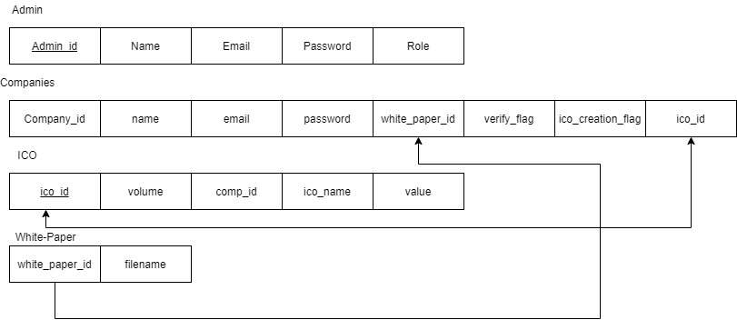
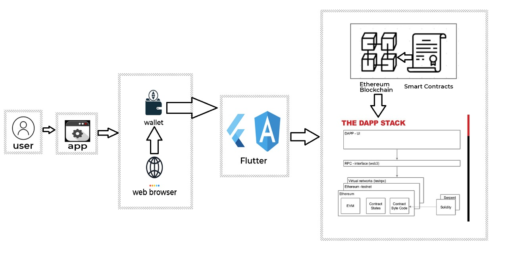
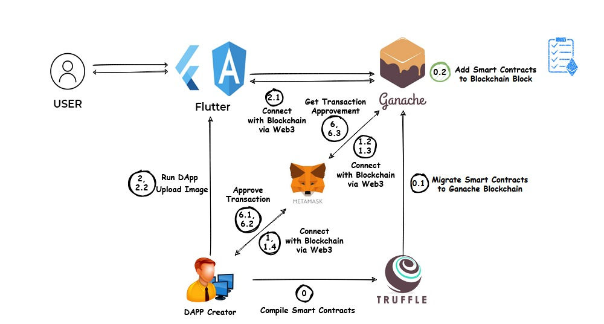

Project Title : Coalesce : Funding through blockchain

***Date: 10/06/2022***                                  

Prepared By : Prabhat Joshi , Anzar Shah ,Dinanshu Bishwas

#### 1.0 Product Synopsis 
- Can generate token for clients , client can raise fund through the exchange of coins (ICOs)
- Exchange of coins will be through smart contract
- An initial coin offering (ICO) is the cryptocurrency industry's equivalent to an initial public offering (IPO). A company seeking to raise money to fund  a service or product can launch an ICO as a way to raise funds. Interested investors can buy into an initial coin offering to receive a new cryptocurrency token issued by the company. This token can represent a stake in the company or project or can be used as a utility coin for future use in that platform. But this token  will not ensure any authority of investor in the company , the founder or initial investor will have all the authority in the company. Alongside structuring the ICO, the crypto project usually creates a white paper, which it makes available to potential investors via a new website dedicated to the token. The promoters of the project use their white paper to explain important information related to the ICO.

- A white paper is an informational document usually issued by a company to promote or highlight the features of a solution, product, or service that it offers or plans to offer. White papers are also used as a method of presenting government policies and legislation and gauging public reaction.

- Whenever a crowd sale takes place, the company gets liquid capital in the form of Ether that was paid by the investors, as well as holding onto a reserved amount of the ERC-20 tokens that were sold in the crowd sale
- An initial coin offering (ICO) is the cryptocurrency industry's equivalent to an initial public offering (IPO). A company seeking to raise money to fund  a service or product can launch an ICO as a way to raise funds. Interested investors can buy into an initial coin offering to receive a new cryptocurrency token issued by the company. This token can represent a stake in the company or project or can be used as a utility coin for future use in that platform. But this token  will not ensure any authority of investor in the company , the founder or initial investor will have all the authority in the company. Alongside structuring the ICO, the crypto project usually creates a white paper, which it makes available to potential investors via a new website dedicated to the token. The promoters of the project use their white paper to explain important information related to the ICO.

- A white paper is an informational document usually issued by a company to promote or highlight the features of a solution, product, or service that it offers or plans to offer. White papers are also used as a method of presenting government policies and legislation and gauging public reaction.

- Whenever a crowd sale takes place, the company gets liquid capital in the form of Ether that was paid by the investors, as well as holding onto a reserved amount of the ERC-20 tokens that were sold in the crowd sale

- The investor will buy token from our in which we will use smart contract . The smart contract governs all of the rules for how the crowd sale works and how the price is regulated.
If a lot of people buys these tokens than we can list it exchange platform.

##### Colour schema 

##### Product Database :

    
##### TECH STACK :

##### DEPENDENCIES :

Ganache ,Truffle, web3.js ,Open-zeppelin ,Metamask, Node ,Angular

